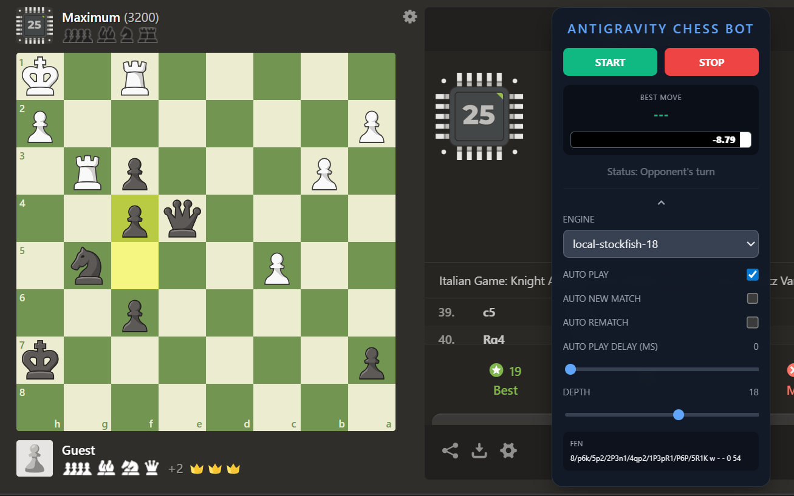

# Antigravity Chess Bot

Antigravity Chess Bot is a powerful Chrome Extension designed for **Chess.com**. It integrates advanced engine analysis directly into your browser, allowing you to observe, analyze, and learn from top-tier chess engines in real-time.

## 🚀 Purpose & Vision

The primary goal of this extension is **education through observation**. 

*   **Engine vs. Bot Matchups**: It is specifically built to simulate matches between different engines and Chess.com's computer personalities (bots).
*   **Learning Tool**: By watching how high-level engines (like Stockfish 18) navigate complex positions against AI, players can improve their tactical awareness and positional understanding.

> [!WARNING]
> **STRICT FAIR PLAY POLICY**
> This application is strictly for educational purposes and for use against AI/Bots only. **DO NOT use this tool against real human players.** Using chess bots in competitive matches against humans is a violation of Chess.com's Terms of Service and undermines the spirit of the game.

## ✨ Key Features

*   **Dual Engine Support**: Switch between **Local Stockfish 18** (running in your browser via WASM) and high-performance **API-based** engines.
*   **Real-time Evaluation Bar**: A dynamic, responsive eval bar that shows the advantage from the current player's perspective.
*   **Auto Play Mode**: Automatically execute engine moves with customizable delays to simulate match flows.
*   **Smooth UI**: A modern, draggable overlay panel that stays out of your way.
*   **Customizable Depth**: Adjust analysis depth to balance speed and power.

## 🛠️ Installation

1.  **Download & Extract**: Download or clone this repository to your local machine.
2.  **Chrome Extensions**: Open Google Chrome and navigate to `chrome://extensions`.
3.  **Developer Mode**: Toggle the **Developer mode** switch in the top right corner.
4.  **Load Unpacked**: Click the **Load unpacked** button.
5.  **Select Folder**: Navigate to your project directory and select the `src` folder (the folder containing `manifest.json`).

## ⚙️ How to Use

1.  Navigate to any game or analysis page on [Chess.com](https://www.chess.com/play/computer).
2.  The **Antigravity** panel will appear on the screen.
3.  Click **START** to begin board detection and analysis.
4.  Toggle **AUTO PLAY** if you want the bot to make moves automatically (ideal for engine-vs-bot matches).
5.  Use the **Advanced Settings** (gear/arrow icon) to switch engines or adjust depth/delays.

## 💡 Optimal Settings for Auto Features

To ensure **Auto New Match** and **Auto Rematch** functions correctly without interruptions, please disable the following features in your settings:

### Coach Settings
*   Motivational messages
*   Reminders
*   Voice
*   Puzzles
*   Show puzzle goals
*   Show mistake feedback
*   Show chat hints

### Interface Settings
*   Show Streaks
*   Collect puzzle points
*   Show post-game feedback
*   Enable Special Themes
*   Show piece icons in game notation

## ⚖️ Ethics & Responsibility

Respect the chess community. This tool is meant to be a companion for learning and bot-testing. Always maintain high standards of sportsmanship.
